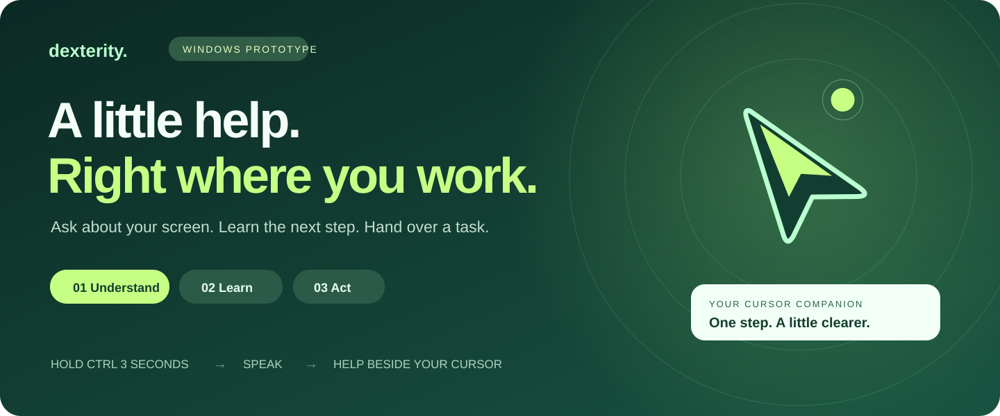

# Dexterity: hackathon demo and remaining work

[Visual product tour](docs/GALLERY.md) · [Windows launch diagnosis and signed build path](docs/WINDOWS.md)

For the submission video, use the [two-minute story and recording script](VIDEO_SCRIPT.md).

Status: 13 September 2026, version 1.7. This is a working Windows prototype. Screen understanding runs on Gemini 2.5 Pro through OpenRouter, with automatic downgrade to 2.5 Flash and then Flash Lite when the chosen model is unavailable or rate limited. Voice tasks still start automatically after transcription, with no Run step. Every task now shows a visible action log and its measured time, requests, tokens and estimated price. The eight-action limit and mandatory approval checks remain. It does not add continuous observation or a Mac version.

**The flow to present:** focus your app → hold Ctrl for 3 seconds → speak → pause → Dexterity works beside the cursor. Only a protected action needs an approval click. Set up the practice form before presenting so you can lead with the voice flow.

## Current blockers — check before presenting

The source launcher works. `Start Dexterity.cmd` started version 1.7 on this PC and the window opened, so that is the tested launch path for the presentation. The packaged executable is still unsigned, and Windows Application Control has blocked the single-file portable wrapper here before. Version 1.7 also passed an automated launch of the packaged app-folder executable under test conditions. Do not promise the unsigned build will start on an unfamiliar PC.

The live provider rehearsal passed voice answers, existing-session navigation, and visual teaching. It filled the browser form but returned a plain-text permission question before submission. The instruction has been corrected to request the application’s approval button, but this revised handoff has not been live-retested. Source tests passed actual Chrome form filling/submission and highlighted-text companion output, plus new-tab session preservation with a generated local cookie. The current Chrome application-form tab was inspected read-only: its visible text fields are exposed. This is not a guarantee for every Google Forms field or page.

## Before you present

1. Double-click **Start Dexterity.cmd**, which started version 1.7 successfully on this PC. The packaged alternative is `release-v1.7/win-unpacked/Dexterity.exe`, kept together with the whole `win-unpacked` folder. It is unsigned, so prefer the launcher on stage.
2. This build ships with a working OpenRouter key, so it runs with no setup. Still run one short question before presenting to confirm the account has credit and the venue network allows the request. The automated tests do not prove either. Keep the Settings page off screen during the presentation, and rotate the built-in key after the event.
3. Use a close microphone or headset. Rehearse one sentence in your own accent. Wait for Listening before speaking, then pause or use **Done speaking**. Voice starts work automatically. If the request is wrong, press **Escape**, then repeat it or use typed input.
4. Put the names, places and app names you will say into **Settings → Words Dexterity keeps mishearing**. They are sent with every recording as preferred spellings, and this is the most effective fix when a recogniser keeps producing the wrong proper noun. If you would rather confirm each spoken request, switch on **Show me what you heard before running**; the dashboard then opens with the recognised text and a five-second countdown. It is off by default so the hands-free flow above stays intact.
5. Close irrelevant windows and notifications. Use the local practice form with the sample details below. Keep **Escape** available to stop a task. Leave the target form untouched while Dexterity works.
6. Rehearse the sequence below once with the actual provider. Allow extra time for network responses; the timings are a presentation target, not a latency guarantee.

The single-file `release-v1.7/Dexterity-1.7.0.exe` was blocked by Windows Application Control on this PC and is not the tested launch path for this presentation. `Start Dexterity.cmd` also runs the source version when the project and installed dependencies are present.

## Four concrete tasks to present

| Task | Exact interaction | Visible success |
| --- | --- | --- |
| 1. Explain a highlighted word | Select **ubiquitous** in your current browser, then press **Ctrl + Shift + E**. Alternatively, say “What does ubiquitous mean? Give one example.” | Definition in the mint companion bubble; dashboard stays closed. |
| 2. Open a page in the same session | Focus your normal signed-in browser. Say “Open https://example.com in a new tab in this browser.” Keep Use my screen on. | A new tab in the same window; the original tab and profile remain. |
| 3. Fill and submit a form | Use the local practice form. Say “Fill this form with name Alex Builder and email alex@example.test. Submit after I review it.” | Correct values, approval button before submission, then visible confirmation. |
| 4. Teach one visible step | Focus the form. Say “Teach me how to fill this form. Give one first step and point at Full name.” | Short mint teaching bubble and a marker when the model provides a valid target. |

These are the scoped presentation tasks. The live verification uses an owned local browser form and generated session cookie to test preservation without touching your personal accounts. A cookie fixture is not a real login. For the stage, use your normal browser window; do not use an older Dexterity-created profile.

## Three-minute demo

### 0:00–0:25 — Show the cursor buddy

Say: “Dexterity is an AI companion beside my cursor. I can ask about what I see, get one teaching step at a time, or delegate a short task.”

Close the dashboard using its window close button. With the companion enabled, the buddy stays on screen. Right-click it and choose **Open dashboard** when you need the controls again. **Quit Dexterity** exits the app; it is different from closing the dashboard.

### 0:25–1:00 — Voice to action beside the cursor

1. In **Ask Dexterity**, select **Answer** and turn **Use my screen** off for this general question.
2. Hold **Ctrl** for three seconds, or click the buddy. Say: “What does ubiquitous mean? Give me one example.”
3. Pause. Transcription finishes and the request starts automatically. No dashboard or Run click is needed.
4. Show the answer in the compact mint companion bubble. Say: “I speak once and it starts helping in place.” No screen capture is needed for this voice example.
5. To show selection instead, keep Use my screen on, highlight a word in your browser and press **Ctrl + Shift + E**. The meaning appears beside the cursor. Highlighting alone does not upload text.

Triple left-click also activates voice, but those clicks still reach the underlying app. Use Ctrl or the buddy for the presentation.

### 1:00–2:15 — Complete a real local task

1. Choose **Try real automation** under **How to use Dexterity for everyday work**. This opens **Dexterity practice form**, selects **Do it**, enables screen use, selects the form, and inserts a suggested task.
2. Close the dashboard, focus the practice form, and hold Ctrl for three seconds. Say: “Fill this practice form with name Alex Builder and email alex@example.test. Submit the registration after I review it.” Pause. The task starts automatically against the remembered form.
3. Show the name and email changing in the actual form and the companion's progress. Say: “It reads the app again after each action. A coordinator plans, one operator acts, and a verifier checks the result.” The plan, the action log and the running cost badge are in the dashboard when it opens for review.
4. At **Approve this action**, show the filled values and the Submit registration target. Nothing has submitted yet. Check the details, then click **Approve this action & continue** before the review expires.
5. Show `Submitted: Alex Builder` in the local form and Dexterity’s completion response. This changes a real Windows form, but sends no registration to a website.
6. Point at the action log and the badge above it. Every action performed is listed with the control it touched and the value typed, the completion check appears as its own pass or fail row, and the badge shows the elapsed time, model requests, tokens and estimated price for the task you just watched.

Say: “Each task allows at most eight actions. Two consecutive actions without an observable screen change stop the task and show what was tried. Controls containing submit, send, pay, delete, confirm, or purchase in their name or type always require approval.”

Do not claim the stall detector was demonstrated by this successful form run. Its unchanged-screen behavior is covered by automated tests.

### 2:15–3:00 — Teach beside the cursor

1. Finish the form task. Keep **Use my screen** on, close the dashboard, and focus the practice form.
2. Hold Ctrl for three seconds. Say: “Teach me how to fill this form. Show me where the Full name field is. Give me only the first step.” Pause; the teaching request starts automatically.
3. Show the floating lesson. If the model supplies a valid visible target, use **Show me where** to display the marker. A marker is not guaranteed for every response; do not describe one that is absent.
4. Follow the instruction yourself, then click **I did it →** to request the next screen check. Teaching points and explains; it does not click for you.

Close with: “The useful part is staying in the app I’m working in, with context, guidance, and short tasks I can inspect.”

## Optional segments after rehearsal

**Your original DaVinci idea:** open a clip on the Color page before presenting. Activate voice and say: “Teach me how to color grade this clip. Start with one small step.” “Teach me” selects the teaching mode and starts the lesson automatically. Follow one instruction and request the next screen check. Rehearse on your exact Resolve layout: guidance is screenshot-based, marker positions are estimates, and arbitrary Resolve automation has not been validated.

**Portable personal context:** open **My context**, paste `Name: Alex Builder` and `Email: alex@example.test` on separate lines into the import flow, review the entries, and enable them. Start a fresh practice form and ask: “Fill this form with my saved name and email. Submit after I review it.” Show the included memory titles and final approval. Export Markdown to show portability. Imports are local file/paste imports; Dexterity does not sign in to another AI account.

## If something goes wrong on stage

| What happens | What to do |
| --- | --- |
| Wrong words or background speech | Press Escape to stop; completed actions remain. Cancel before transcription finishes when possible. Repeat the corrected goal or use typed input. |
| Voice does not activate | Click **Talk to Dexterity** or the buddy. Check microphone access in Settings. Do not spend the presentation repeatedly trying a shortcut. |
| Provider/network/credit error | Show the error honestly. Check the connection before another attempt. Generated test results or a rehearsal recording must be labeled as such; there is no offline AI demo mode. |
| Wrong target app | Stop. For voice, focus the correct app before activating the microphone again. For typed tasks, refresh **Work in** and select the exact window. |
| Two unchanged actions or eight-action limit | Read the handoff and action log. Inspect the app, then give a smaller new goal. The app does not silently resume. |
| Approval expires or a reviewed field changes | Start again to read the current state, then review the new action. |
| No teaching marker | Use the written instruction. Reframe the question around one visible control; do not claim exact pointing is available everywhere. |
| Answers feel slow on stage | Change the model in Settings to `google/gemini-2.5-flash`. Measured on the same live path it is roughly twice as fast and a fifth of the price, but it places on-screen pointers less accurately. |
| A model is rate limited | Nothing to do. OpenRouter moves to the next model in the list and the answer names the one that actually served it. |

## What remains

| Priority | Remaining work | Current boundary |
| --- | --- | --- |
| Before presenting | Live rehearsal on the demo microphone with your own voice | Generated audio, mocked provider tests and a live provider run all passed; none of them establish accuracy on your accent. |
| After the event | Rotate the built-in OpenRouter key | It ships inside the executable, so anyone holding the executable can extract it. It is excluded from Git and appears in no commit. |
| Before wider Windows distribution | Signed packaging and validation on other PCs | The source launcher starts version 1.7 here and the packaged app-folder executable passes an automated launch. Application Control blocked the single-file portable wrapper. |
| Product expansion | Opt-in continuous observation and proactive suggestions | The buddy remains present, but screen/audio capture is on demand. It needs an initial goal. Imported context does not grant authority to choose tasks. |
| Product expansion | Mac native control, activation, permissions, packaging, and device testing | No Mac build exists. Claude delegation was unavailable. The current native helper depends on Windows APIs. |
| Reliability | Human accent/noisy-room evaluation, app coverage, and DaVinci workflow testing | VAD does not identify which person is speaking. Automation needs supported accessibility controls. Visual teaching is approximate. |
| Reliability | Broader stalled-screen and consequential-action evaluation | A text/control signature can miss visual-only progress or change because of unrelated content. Keyword checks do not classify every possible consequential action. |

The earlier voice Run gate has been removed at the user’s request. The eight-action cap and explicit protected-action approval rules remain completed requirements. There is no promise of unrestricted control over every app.

## Evidence and architecture for judges

The automated suite contains 50 checks, including the cost estimate, the usage totals, the spelling hints and the action ledger, with a failed completion check asserted to reach the visible log before the runner continues. Native self-tests and source browser tests passed. Earlier voice/form tests passed against a packaged build; the latest rebuild is blocked, as described above. Voice testing confirms that transcription starts a companion task automatically without showing the dashboard. A spoken form request fills real fields before the dashboard opens solely for protected submission approval. A recognized Stop starts no task. The form test exercised real Windows controls, approval, submission, and visible completion. The eight-action and unchanged-screen tests exercise the runner. Provider responses in these integration tests were mocked; generated speech was used for the voice test. A live run against OpenRouter exercised the real decision path on a screenshot: two form-filling actions, a general answer, a teaching step with a pointer target, and a completion check that correctly refused a claim of completion while a requested field was still empty. Measured on that path, Gemini 2.5 Pro took 7.8 seconds and about $0.0065 for a field action against 4.0 seconds and $0.0014 for 2.5 Flash, and both decided correctly. A live run with your own microphone still needs the preflight above.

Personal context and optional task history are encrypted in `%APPDATA%\dexterity\context.vault`; API keys are encrypted in `preferences.json`. Audio and screenshots stay in app memory and are sent to the configured provider when needed. There is no Dexterity cloud database or account sync. The “agents” are sequential roles using separate requests, with one desktop operator. See [README.md](README.md) for usage and data details and [ARCHITECTURE.md](ARCHITECTURE.md) for implementation.
